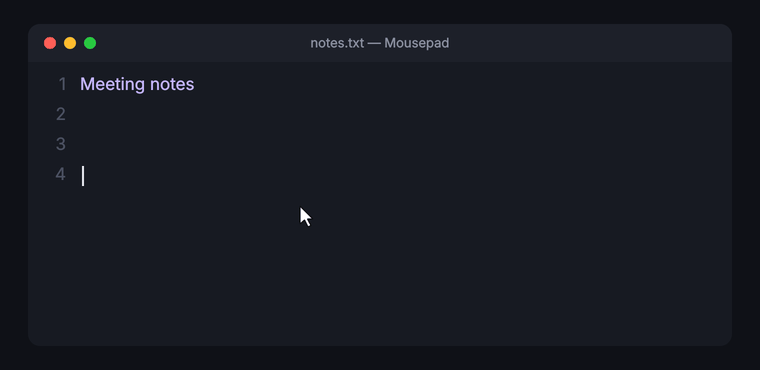
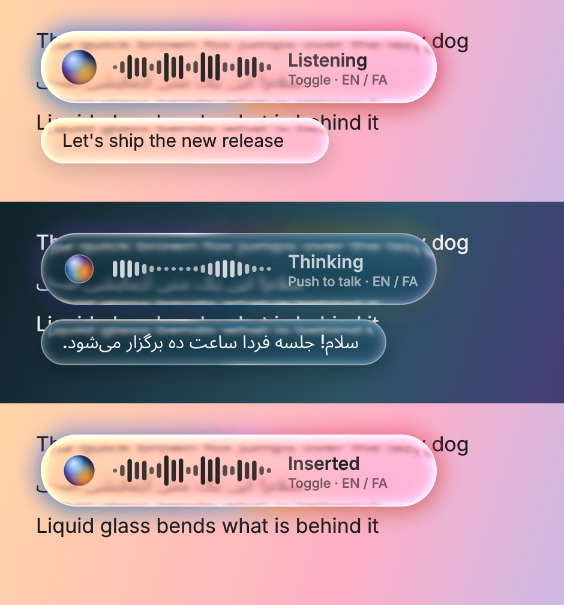
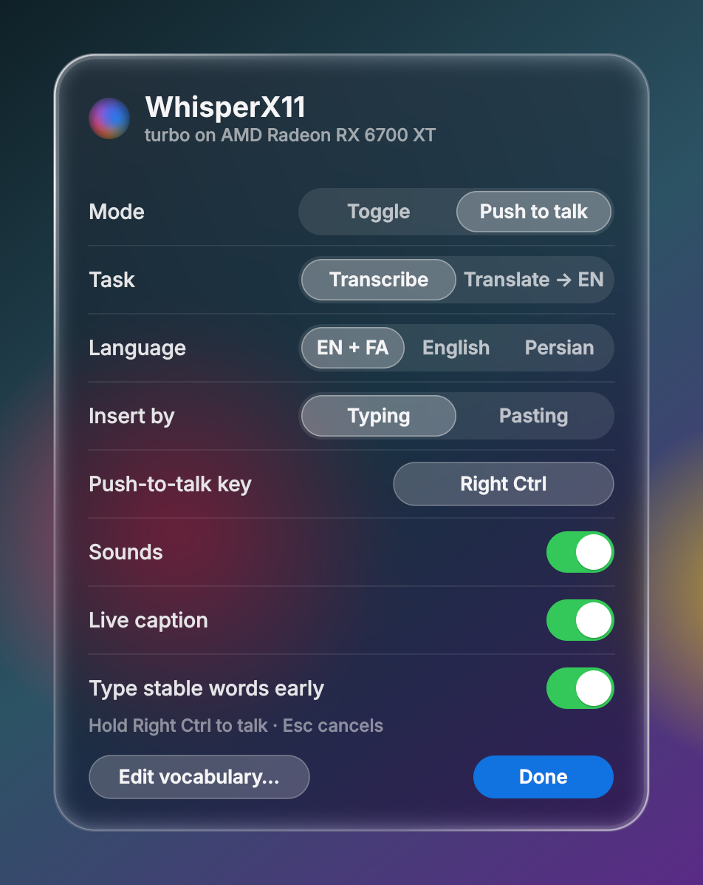

<div align="center">

# WhisperX11

**Real-time voice typing for Linux, powered by [OpenAI Whisper](https://github.com/openai/whisper) on your GPU.**

Talk, and your words are typed into whatever text box has focus while you speak, in English,
Persian, or any of Whisper's 99 languages. The interface is a liquid-glass overlay that refracts
the screen behind it.



</div>

---

## Features

**Dictation**
- **Live typing:** words are typed as soon as Whisper is sure of them, about a second behind your voice.
  Two consecutive previews have to agree on a word before it's typed. When a sentence ends, the
  final transcript fills in the rest, and if it disagrees with what was already typed, that part is
  corrected with backspaces.
- **Live caption:** a glass caption under the overlay shows the sentence being recognised.
- **Two modes, switchable any time:** **Toggle** (Ctrl+Alt+Space starts and stops; stopping talking
  ends it) or **Push to talk** (hold a key, Right Ctrl by default, and release to finish).
- **Bilingual:** each sentence is auto-detected between your languages (default English + Persian).
- **Translate to English** (optional): speak Persian or any other language and English is typed.
  This needs the `medium` model, because `turbo` was not trained to translate.
- **Personal vocabulary:** names and terms in `~/.config/whisperx11/vocab.txt` are given to Whisper
  as context, so it spells them your way.
- **Silero VAD:** a neural speech detector decides where sentences start and end, ignoring keyboard
  clicks, fans and breathing.
- **No clipboard needed:** text is typed through XTest with spare keycodes temporarily remapped to the
  exact characters needed. This works with multi-layout keyboards (e.g. `us,ir`) whichever layout is
  active, and even while you hold a modifier for push-to-talk. A clipboard-paste mode is available too.
- **Sound cues:** soft chimes on start, finish and cancel.

**Interface**
- **Liquid glass:** the overlay, caption and settings panel are rendered from the live pixels behind
  them, with lens refraction at the rim, chromatic dispersion, frosted vibrancy, Fresnel edge light,
  moving specular highlights and a soft shadow. They adapt to light and dark content underneath.
- **Apple Intelligence-style glow** that breathes with your voice, plus a Siri-like orb.
- **Tray icon and settings panel:** switch mode, task, language and insert method, choose the
  push-to-talk key, toggle sounds, caption and early typing, and edit the vocabulary. Every
  change applies instantly and is saved.

**Performance**
- The model stays on the GPU in fp16 and is warmed up at start. On an RX 6700 XT, `turbo`
  transcribes a 5-second sentence in about 0.45 s. NVIDIA (CUDA), AMD (ROCm) or CPU.

<table>
<tr>
<td width="50%"></td>
<td width="50%"></td>
</tr>
</table>

## How it works

```
 hotkey / push-to-talk ─► liquid-glass overlay at the pointer
            │
   mic ─► 100 ms blocks ─► Silero VAD (speech / silence per block)
            │
            ├─ every ~0.6 s while speaking: Whisper on the unfinished sentence
            │       ├─► live caption
            │       └─► words two previews agree on ─► typed now
            │
            └─ pause ≥ 0.6 s: Whisper on the finished sentence (en|fa, or → English)
                    └─► type the rest / correct with backspaces
```

1. Global keys come from `pynput` on X11, or from `evdev` on Wayland.
2. Audio is captured in 100 ms blocks, and Silero VAD marks each block as speech or not. A pause of
   `--pause` seconds ends a sentence; long monologues are cut at their quietest moment.
3. One worker thread runs Whisper. Finished sentences go first; in between, it re-transcribes the
   sentence still being spoken, for the caption and early typing.
4. The language is detected per sentence. Your vocabulary and the previous sentence are passed as
   context.
5. Text is inserted in order by the X11 typer: spare keycodes are bound to the needed characters in
   every layout group and pressed through XTest. Held modifiers are released in the X server for
   the moment of typing, like `xdotool --clearmodifiers`.
6. The glass is computed with NumPy/SciPy from a screen grab of the area behind the window, which
   the compositor returns without our own overlay, refreshed several times a second. Widgets paint
   the moving highlights on top with Qt.

## Requirements

- Linux with **X11** (tested on XFCE, Ubuntu 26.04). **Wayland support is experimental**, see below.
- A **compositor** for translucency (XFCE: *Window Manager Tweaks → Compositor*).
- Python 3.10+ and a microphone.
- **For GPU mode:** a GPU that **already works with PyTorch**, i.e.
  `python3 -c "import torch; print(torch.cuda.is_available())"` prints `True`. WhisperX11 does not
  install drivers, CUDA, ROCm or GPU builds of PyTorch. Set those up first
  ([pytorch.org](https://pytorch.org/get-started/locally/)). AMD GPUs work through ROCm, which
  PyTorch exposes through the same `torch.cuda` API.

## Install

```bash
git clone https://github.com/Neo-vortex/WhisperX11.git
cd WhisperX11

./install.sh --cuda --autostart      # GPU: reuses your existing CUDA/ROCm PyTorch
# or
./install.sh --cpu --autostart       # CPU: installs CPU-only PyTorch, defaults to the small model

./download_model.sh medium           # optional, ~1.5 GB: enables Translate → English
```

| `install.sh` option | |
|---|---|
| `--cuda` (default) | Use the GPU. Needs a working GPU PyTorch in the Python that creates the venv (`PYTHON=/path/to/python` to pick one). Stops with an explanation if `torch.cuda.is_available()` is false. |
| `--cpu` | Run on the CPU. Installs the CPU-only PyTorch wheel if PyTorch is missing. |
| `--model NAME` | Model to download and use (default `turbo` for GPU, `small` for CPU). |
| `--autostart` | Start on login (`~/.config/autostart/whisper-x11.desktop`). |

`download_model.sh` resumes interrupted downloads and verifies the SHA-256 before the model counts
as installed. Until `medium` is installed, Translate is disabled in the UI, with a tooltip explaining why.

## Usage

```bash
./run.sh
```

| | Toggle mode (default) | Push-to-talk mode |
|---|---|---|
| Start | **Ctrl+Alt+Space** | hold **Right Ctrl** (configurable) |
| Text appears | while you talk | while you talk |
| Finish | stop talking for 2.5 s, or the hotkey again | release the key |
| Cancel | **Esc** | **Esc** |

Switch modes from the **tray icon** (right-click), or open the **settings panel** by clicking the
tray icon. Settings are saved in `~/.config/whisperx11/settings.json`.

Each finished sentence is logged with its latency, language and length:

```
[0.47s en 4.7s] The quick brown fox jumps over the lazy dog near the river bank.
[0.63s fa → en 3.9s] Hello. Today I'm going to the university and then I'll have a coffee with my friends.
```

### Options

Flags override the saved settings for one run. Anything you change in the UI is saved.

| Flag | Default | Description |
|---|---|---|
| `--model` | `turbo` | `tiny`, `base`, `small`, `medium`, `turbo`, `large`. Use a multilingual model for non-English. |
| `--mode` | `toggle` | `toggle` or `ptt` (push to talk). |
| `--ptt-key` | `ctrl_r` | Push-to-talk key: `ctrl_r`, `alt_r`, `f9`, … (or pick it in the panel). |
| `--task` | `transcribe` | `translate` types English; needs the `medium` model. |
| `--languages` | `en,fa` | Languages to choose between per sentence. A single value forces it. |
| `--insert` | `type` | `type`: keystrokes, clipboard untouched. `paste`: clipboard + Ctrl+V. |
| `--no-early-commit` | | Only type a sentence once it's finished. |
| `--no-preview` | | No live caption. |
| `--no-sounds` | | No chimes. |
| `--vocab` | `~/.config/whisperx11/vocab.txt` | Vocabulary file, one term per line. |
| `--vad` | `silero` | `energy` uses a simple loudness threshold instead. |
| `--pause` | `0.6` | Pause (s) that ends a sentence. |
| `--max-segment` | `20` | Longer sentences are cut at their quietest moment. |
| `--silence` | `2.5` | Toggle mode: seconds of silence that end the dictation (`0` = hotkey only). |
| `--hotkey` | `<ctrl>+<alt>+<space>` | Toggle hotkey. |
| `--device` | system default | Input device name (substring) or index; `--list-devices` lists them. |
| `--cpu` | | Run on the CPU even if a GPU is available. |

Personal flags can also go in `config.args` (one per line, git-ignored), which `run.sh` reads.

### Vocabulary

```
# ~/.config/whisperx11/vocab.txt  ("Edit vocabulary…" in the panel opens it)
WhisperX11
Kubernetes
Neo-vortex
تهران
```

Whisper reads only about 200 tokens of context, so keep the list short and specific.

### Type vs paste

| | `type` (default) | `paste` |
|---|---|---|
| Clipboard | untouched | replaced, restored after ~0.7 s |
| Speed | ~8 ms per character | instant |
| Live typing / corrections | yes | yes |
| Editors with autocomplete / auto-indent | may react to typed text | not affected |

We also tested `pynput` typing (garbles text on multi-layout keyboards), xdotool (works, but is an
extra dependency), AT-SPI (only some apps expose it) and IBus (switching engines reset the keyboard
layout). The keycode-remapping approach was the only one that passed every test without new
dependencies.

### Models

| Model | Size | Speed (RX 6700 XT) | Notes |
|---|---|---|---|
| `turbo` | 1.6 GB | ~0.45 s per 5 s sentence | **Recommended.** large-v3 quality, good Persian. Can't translate. |
| `medium` | 1.5 GB | ~0.6–1.2 s per sentence | Used automatically for **Translate**. |
| `small` | 0.5 GB | faster | OK English, weak Persian; reasonable on CPU. |
| `base` / `tiny` | <150 MB | fastest | English-centric, fine on CPU. |

## Wayland (experimental)

Wayland doesn't let apps read global keys, inject keystrokes or position windows the way X11 does,
so WhisperX11 uses different backends there:

| | Wayland approach |
|---|---|
| Hotkeys / push-to-talk | `evdev`, reading `/dev/input` directly. Join the `input` group: `sudo usermod -aG input $USER`, then log in again. |
| Typing | `wtype` on wlroots compositors (Sway, Hyprland, labwc), which handles Unicode directly. On GNOME/KDE, `ydotool` + `ydotoold` with clipboard + Ctrl+V via `wl-copy`. |
| Overlay | runs through XWayland and appears at the bottom centre (the pointer position isn't available). The glass uses a neutral backdrop because Wayland doesn't allow reading the screen. |

This path is implemented but **has not been tested on a real Wayland session yet**. Reports welcome.

## Autostart

`./install.sh --autostart` starts the daemon at login and keeps the model warm on the GPU. It can't
start before login, because it needs your desktop session. The log is at `~/.cache/whisper-x11.log`.

```bash
pkill -f 'dictate.py'   # stop (or "Quit WhisperX11" in the tray menu)
./run.sh &               # start manually
```

## Troubleshooting

<details>
<summary><b>Recording hangs / no audio</b></summary>

PortAudio's PulseAudio backend can hang on PipeWire systems. Use the ALSA device of your mic:
`./run.sh --list-devices`, then `--device "My Mic: USB Audio"` (or put it in `config.args`).
</details>

<details>
<summary><b>AMD GPU not used (RDNA2: RX 6700/6600 series)</b></summary>

ROCm only ships kernels for `gfx1030`. `run.sh` sets `HSA_OVERRIDE_GFX_VERSION=10.3.0` automatically
when it detects gfx1031–gfx1036.
</details>

<details>
<summary><b>Words get typed and then corrected</b></summary>

That's early typing meeting a final transcript that disagrees. Turn off "Type stable words early" in
the panel (or `--no-early-commit`) to only type finished sentences.
</details>

<details>
<summary><b>Sentences are split too often / not often enough</b></summary>

Raise `--pause` (e.g. `0.9`) if sentences get cut while you think, or lower it for snappier output.
</details>

<details>
<summary><b>Overlay has a black box instead of glass</b></summary>

Enable your window manager's compositor.
</details>

<details>
<summary><b>No tray icon</b></summary>

Your panel needs a system tray / status notifier area (XFCE: add the "Status Tray Plugin").
</details>

## Project layout

```
dictate.py             entry point
whisperx11/app.py      orchestration: keys, modes, segmentation, worker, inserting
whisperx11/audio.py    microphone capture + Silero VAD
whisperx11/engine.py   Whisper models (transcribe, translate, language detection)
whisperx11/streaming.py early commit of stable words (LocalAgreement)
whisperx11/insert.py   X11 XTest typer / paster, Wayland wtype / ydotool
whisperx11/hotkeys.py  pynput (X11) and evdev (Wayland) key listeners
whisperx11/glass.py    liquid-glass renderer (refraction, dispersion, frost, rim light)
whisperx11/overlay.py  dictation overlay + caption
whisperx11/panel.py    settings panel, glass controls, tray icon
whisperx11/sounds.py   synthesized chimes
whisperx11/config.py   settings, vocabulary, model files
tests/                 unit tests (pytest)
tools/make_media.py    renders the README images from the real widgets
```

The demo GIF and images are rendered headlessly from the real widgets
(`QT_QPA_PLATFORM=offscreen .venv/bin/python tools/make_media.py`). The desktop, editor and timings
in them are a mock-up.

## Credits

- [OpenAI Whisper](https://github.com/openai/whisper) (MIT), [Silero VAD](https://github.com/snakers4/silero-vad) (MIT)
- [PySide6](https://doc.qt.io/qtforpython-6/), [pynput](https://github.com/moses-palmer/pynput),
  [python-sounddevice](https://github.com/spatialaudio/python-sounddevice),
  [python-xlib](https://github.com/python-xlib/python-xlib), [python-evdev](https://github.com/gvalkov/python-evdev),
  [SciPy](https://scipy.org/)
- Design inspired by Apple's Liquid Glass and Apple Intelligence.

## License

[MIT](LICENSE)
